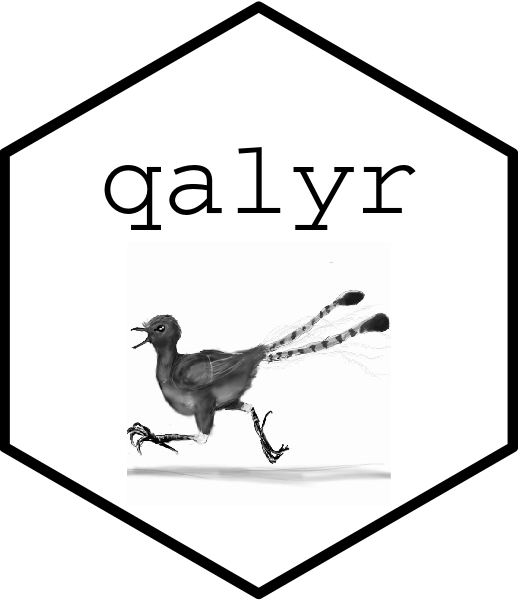

<!-- README.md is generated from README.Rmd. Please edit that file -->

# qalyr 

[](https://www.repostatus.org/#active)

**DRAFT WORKING VERSION** - The package is usable but there are still
bugs and further developments that are being worked through i.e. some
code and documentation is still incomplete or in need of being refined.
The code and documentation are still undergoing internal review by the
analyst team.

## Motivation

`qalyr` was created as part of a programme of work on the health
economics of tobacco and alcohol at the School of Health and Related
Research (ScHARR), The University of Sheffield. This programme is based
around the construction of the Sheffield Tobacco and Alcohol Policy
Model (STAPM), which aims to use comparable methodologies to evaluate
the impacts of tobacco and alcohol policies, and investigate the
consequences of clustering and interactions between tobacco and alcohol
consumption behaviours.

The original motivation for `qalyr` was to standardised the way that
health state utility values were prepared for input to our
decision-analytic models. *describe data*. The suite of functions within
`qalyr` *describe functionality*.

## Usage

`qalyr` is a package for estimating health state utility values.

## Installation

`qalyr` is currently available only to members of the project team (but
please contact Duncan Gillespie <duncan.gillespie@sheffield.ac.uk> to
discuss). To access you need to [**sign-up for a GitLab
account**](https://gitlab.com/). You will then need to be added to the
STAPM project team to gain access.

Once that is sorted, you can **install the development version of
`qalyr`** from GitLab with:

``` r
#install.packages("devtools")
#install.packages("getPass")

devtools::install_git(
  "https://gitlab.com/stapm/qalyr.git", 
  credentials = git2r::cred_user_pass("uname", getPass::getPass()),
  ref = "x.x.x",
  build_vignettes = TRUE
)

# Where uname is your Gitlab user name.
# ref = "x.x.x" is the version to install - remove this to install the latest version
# this should make a box pop up where you enter your GitLab password
```

Then load the package, and some other packages that are useful. Note
that the code within `qalyr` uses the `data.table::data.table()` syntax.

``` r
# Load the package
library(qalyr)

# Other useful packages
library(dplyr) # for data manipulation and summary
library(magrittr) # for pipes
library(ggplot2) # for plotting
```

## Citation

Please cite the latest version of the package using:  
“Duncan Gillespie, Laura Webster, Colin Angus and Alan Brennan (2020).
qalyr: Health State Utility Value Estimation. R package version x.x.x.
<https://stapm.gitlab.io/qalyr>.”

## Getting started

*how to access data*

In ScHARR, all data is stored and processed according to the [ScHARR
Information Governance
Policy](https://www.sheffield.ac.uk/scharr/research/igov/policy00).
*where data is stored*

No individual-level data is included within this package.

## Basic functionality
