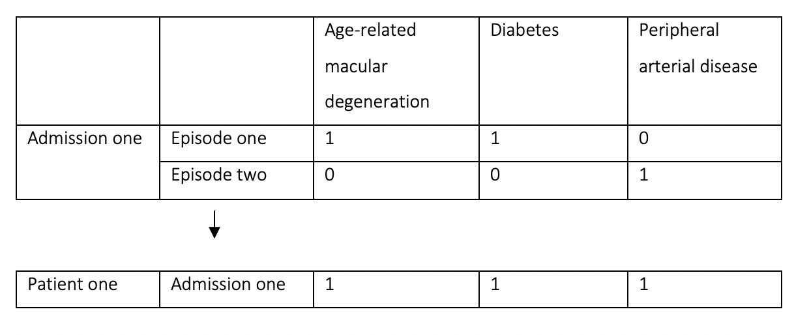

Duncan Gillespie^1^, Laura Webster^1^, Colin Angus^1^ & Alan Brennan^1^

\vskip 1em

^1^School of Health and Related Research (ScHARR), The University of Sheffield

\vskip 1em

**Address for correspondence**:\
Dr Duncan Gillespie\
Section of Health Economics and Decision Science,\
School for Health and Related Research,\
The University of Sheffield,\
Regent Court, Regent Street, Sheffield, S1 4DA, UK\
Email: [duncan.gillespie\@sheffield.ac.uk](mailto:duncan.gillespie@sheffield.ac.uk){.email}

\vskip 1em

```{=tex}
\begin{tcolorbox}[colback=red!5!white,colframe=red!75!black,title=WARNING]
This is a working version that is subject to review and future versions are likely.
\end{tcolorbox}
```
\vskip 1em

The code that accompanies this report can be found here in the qalyr R package (<https://stapm.gitlab.io/r-packages/qalyr/>). This report is licensed to The University of Sheffield under a [CC by 4.0](https://creativecommons.org/licenses/by/4.0/) license.   

\newpage

```{r setup, include = FALSE, results = 'hide', warning = FALSE}

knitr::opts_chunk$set(
  collapse = TRUE,
  comment = "#>",
  fig.pos = 'H'
)

options(tinytex.verbose = F)

suppressPackageStartupMessages(library(magrittr))
suppressPackageStartupMessages(library(knitr))
suppressPackageStartupMessages(library(kableExtra))
suppressPackageStartupMessages(library(data.table))
suppressPackageStartupMessages(library(ggplot2))
suppressPackageStartupMessages(library(readxl))
suppressPackageStartupMessages(library(tobalcepi))
suppressPackageStartupMessages(library(stapmr))
suppressPackageStartupMessages(library(smktrans))
suppressPackageStartupMessages(library(ggthemes))
suppressPackageStartupMessages(library(RColorBrewer))
suppressPackageStartupMessages(library(cowplot))

```

```{r include=FALSE, eval=F}
# automatically create a bib database for R packages
knitr::write_bib(c(
  .packages(), 'bookdown', 'knitr', 'rmarkdown'
), 'packages.bib')
```
 
# Summary {-}
This methodology report sets out how we calculate health state utility values for use in the STAPM modelling. It describes the data sources we use to calculate mean disease-specific utility values and general population utility values (that we take to represent the utility of not having a tobacco- or alcohol-related disease). We also explain how we deal with small sample sizes and how we stratify our utility value estimates by age and sex.    

\bigskip
\bigskip

# Glossary of terms {-}

```{r table1, eval = T, warning = F, echo=F, cache = F}

df_table1 <- readxl::read_xlsx('inst/Glossary.xlsx','glossary')

df_table1 %>%
  kableExtra::kbl(booktabs = T, caption = "Explanation of terms.", label = "table1", linesep = "\\hline", escape = F, longtable = T) %>%
  kableExtra::column_spec(column = 1, width = "5cm") %>%
  kableExtra::column_spec(column = 2, width = "11cm") %>%
  kableExtra::kable_styling(font_size = 8, latex_options = c("HOLD_position")) 

```

\newpage

\hypersetup{linkcolor=blue}
\tableofcontents

\newpage

# Introduction
In our STAPM modelling, one of the ways that we quantify health benefits is by quality adjusted life-years (QALYs). QALYs are calculated by summing the time spent in a health state weighted by the health-state utility value (HSUV) associated with the health state, thus incorporating both length of survival and HSUVs into a single metric [@Ara2010]. In the UK, there is a preference to quantify HSUVs with EQ-5D data using UK population weights when available [@NICEguide].    

# Background
We build on the methods to estimate HSUVs that were developed to support the Sheffield Alcohol Policy Model (SAPM) [@Brennan2009]. The previous SAPM work used the Health Outcomes Data Repository (HODaR) data to estimate a mean utility score for each disease [@currie2005routine]. People in the "no tobacco- or alcohol-related conditions" health state were assumed to have the utility score of the general population [@Ara2010;@ara2011using]. Thus, if a person within our modelled population lives a year of life with a tobacco- or alcohol-related disease, then that year of life is given a disease-specific utility score, but if a person lives a year of life without any tobacco- or alcohol-related diseases, then that year of life is given the general population utility score.   

## The Health Outcomes Data Repository (HODaR) data
The HODaR data was collected as part of an initiative by the Cardiff Research Consortium to provide a source of data on patient socio-demographics, clinical factors, quality of life and healthcare resource use from the same patient group [@currie2005routine]. The HODaR data measures utilities using the EQ-5D, a widely used generic (disease non-specific) quality of life instrument as recommended by the National Institute for Health and Care Excellence (NICE) for health economic evaluation [@NICEguide]. Relevant points of description from Currie et al. [-@currie2005routine] are:   

- HODaR supplements routine clinically coded data from the Cardiff and Vale NHS Hospitals Trust, UK, with survey data covering sociodemographic characteristics, QoL, utility, and resource use information.  
- Data that constitutes HODaR were collated from a prospective survey of subjects treated as inpatients or outpatients. Details from the survey are then linked to existing routine hospital health data.  
- All inpatients aged 18 years or older are surveyed. Subjects with a record of a psychological illness or learning disability are presently excluded if they were admitted with a primary diagnosis for a psychological illness. Subjects who were known to have died are also excluded. Outpatient clinics are included on a rotational basis with all patients within the selected clinic surveyed.  
- For inpatients, all subjects are surveyed 6 weeks post-discharge by postal survey with a 'freepost' return envelope. For outpatients, all patients attending a selected clinic are handed a survey pack by the clinic receptionist when they attend. No reminders are sent to non-responders.  

We were provided with two datasets in the form of inpatient data and survey data:  

- The inpatient data includes a pseudo-anonymised patient identification number and information on the type of admission including the dates of admission and diagnostic and operation codes. The inpatient data is provided at episode level and was filtered such that we were only provided with episodes that had an alcohol or tobacco-related ICD-10 code in one of the diagnostic positions.  

- The survey data includes the patient's pseudo-anonymised identification number, the postal and response date of the survey, and further patient information including gender, year of birth, alcohol and tobacco consumption and EQ-5D responses.   

## Programme of work
The University of Sheffield is conducting a programme of work to model the health and economic impact of policies and interventions that aim to reduce the consumption of tobacco and alcohol to improve health for all. This builds on previous research using the Sheffield Alcohol Policy Model (SAPM) [@Brennan2015;@Brennan2016]. This research takes into account health-related quality of life, i.e. we model effects on mortality and on the quality of life while alive and experiencing a disease (by using estimated HSUVs). The utility values for the set of alcohol-related diseases used in SAPM were derived from a previous analysis of the HODaR data [@Brennan2009]. In our STAPM modelling, we use the HODaR data to extend our analysis of HSUVs to cover our full set of tobacco and alcohol related diseases.    

### Diseases attributable to tobacco and/or alcohol {#smokediseases}
We estimate utility scores associated with 84 categories of diseases defined by ICD-10 codes. This list includes several cancers, cardiovascular diseases and respiratory diseases. We consider 52 diseases related to tobacco [@Webster2018] and 45 diseases related to alcohol [@Angus2018] (we then expand the alcohol list to 48 conditions when merging our tobacco and alcohol disease lists by subdividing some of the ICD-10 categories). Within our merged disease list, there are 15 conditions that are related to both tobacco and alcohol.   

### Disease-specific morbidity rates
In the SAPM, we approximate the prevalence of different diseases in the population based on person-specific rates of hospitalisation estimated from Hospital Episode Statistics (HES) data. We stratify these rates by age, sex and socio-economic conditions (in terms of Index of Multiple Deprivation quintiles). The logic of calculating person-specific hospitalisations goes as follows: if the same person was admitted on three separate occasions for oesophageal cancer during the year, then this would be counted as just one person-specific hospitalisation. When an individual is admitted on two or more different occasions for two different reasons (e.g. once for oesophageal cancer and once for a fall), then the person-specific admission a set of rules are applied to attribute the admission to one of these reasons to avoid (see our report on the [methods to process hospital admission data](https://stapm.gitlab.io/r-packages/hesr/articles/English_secondary_care_modelling_report.pdf) for use in the STAPM modelling). The result of using this method is that in any year of the model we can partition individuals among our set of 84 tobacco- and alcohol-related conditions, i.e. between 84 mutually exclusive health states, and an additional "no tobacco- or alcohol-related conditions" health state.     

# The aim of this report
This report is focused on explaining our choice of method to estimate mean utilities for the 84 conditions related to tobacco and/or alcohol based on analysis of the HODaR data. We also explain how we estimate the utility of people who do not have any tobacco or alcohol related disease. We describe our methods to deal with small sample sizes, and to stratify our utility estimates by age and sex.  

# Methods

## Process HODaR inpatient data
We first load the episode-level inpatient data, retaining the pseudo-anonymised patient ID, the dates of admission and discharge, the number of the episode within the admission (1st, 2nd ...), 13 diagnosis positions into which an ICD-10 code could be entered. We then collapsed the episode-level dataset to an admission-level dataset. This new admission-level dataset contained a column for each tobacco and/or alcohol related diagnosis in which we indicated with 0 or 1 whether that admission contained the corresponding diagnosis code in any of the 13 diagnostic positions of any episode. Thus, rather than select a single disease diagnosis to assign to an admission (which we do when we calculate the rates of hospital admissions for each disease), we instead indexed each admission by multiple tobacco and/or alcohol related diagnoses. This methods choice was made to maximise the sample size available to calculate the mean utility for each diagnosis. Figure \@ref(fig:epidiag) shows an example of how an admission including two episodes, where the first episode contained two alcohol/tobacco-related conditions, and the second episode a further tobacco-related condition, is collapsed into one admission containing all three.   

```{r epidiag, fig.cap = "Example of collapsing episodes into admissions.", out.width = "75%", out.extra = "", fig.pos = "h", echo=FALSE, fig.align="center"}



```

## Process HODaR survey data 
We first load the HODaR survey data, and removing missing values for age, sex and the five dimensions of the EQ-5D (mobility, self-care, usual activities, pain, and depression). We then calculate the EQ-5D-3L using the time trade-off (TTO) valuation technique using the `eq5d` R package [@eq5dpackage].

## Combine the HODaR inpatient and survey data 
A patient may have several admissions throughout the year. During this time, a survey is sent out (usually six weeks after discharge). The only matching variable that both datasets contained was the patient ID - our problem was therefore how to match the survey data to the inpatient data when there were several admissions throughout the year.     

The inpatient data and the survey data are matched using the patient ID. Three rules are applied to help ensure that the survey responses are matched to the most appropriate admissions:   

1. The admission must be discharged before the survey was sent,
2. The time between the patient discharge and the date of the survey sent must be under a year,
3. If an admission matched with two surveys, the admission is matched to the earliest survey.

If a survey is matched with multiple admissions, we assume the survey applies to all admissions within the previous year. In the absence of data at other time points we assume that the six-week utility score from the survey is representative of the score for a full year in our model.   

## Calcuate mean utility scores for tobacco- and alcohol-related conditions
A mean utility value is estimated for each condition based on ICD-10 codes. Due to the way we set up the HoDAR data to have a column representing each condition with a binary variable signifying whether that condition was in the admission, we simply averaged across the utilities from each admission where the condition was included. Only the overall mean utility for a condition is calculated because stratified analyses by age and sex involve very small sample sizes for some conditions.     

For conditions with no observations or small numbers of observations, where it was not possible to calculate a mean utility score, utilities were assumed to be similar to close conditions. This follows the previous approach in SAPM [@Brennan2009].    

- Utilities for alcohol induced pseudo-cushings syndrome, alcoholic polyneuropathy and degeneration were assumed to be similar to mental and behavioural disorders due to alcohol. 
- Utilities for psychosis were assumed to be similar to schizophrenia. 
- Utilities for alcoholic myopathy were assumed to be similar to utilities for alcohol cardiomyopathy.
- Utilities for excessive blood level of alcohol was assumed to be similar to evidence of alcohol involvement determined by blood alcohol level. 
- Utilities for drowning were assumed to be similar to transport injuries. 
- Utilities for other intentional injuries were assumed to be similar to other unintentional injuries.

## Estimate general population utilities by age and sex
Ara and Brazier [-@Ara2010] fitted a linear regression to EQ-5D values from the Health Survey for England (2003 \& 2006). We use the estimates from their model 1:  

\begin{equation}
\text{EQ-5D} = 0.9508566 + 0.0212126\times{}male - 0.0002587\times{}age - 0.0000332\times{}age^2, (\#eq:arabrazeq)
\end{equation}

which can be used to estimate the mean HSUVs for individuals in the general population (Figure \@ref(fig:arabraz)).    

```{r arabraz, eval = T, warning = F, out.extra='', fig.pos = "H", echo=F, fig.width = 5, fig.height = 3, fig.cap = "General population utility scores for males and females aged 11-89 years.", cache = F, fig.align = "center"}

data <- data.frame(expand.grid(age = 11:89, sex = c("Male", "Female")))
setDT(data)

data[sex == "Male", utility := 0.9508566 + 0.0212126 - 0.0002587*age - 0.0000332*(age^2)]
data[sex == "Female", utility := 0.9508566 - 0.0002587*age - 0.0000332*(age^2)]

ggplot(data) +
  geom_line(aes(x = age, y = utility, linetype = sex)) +
  theme_minimal() +
  ylim(0,1)

```

## Social stratification of condition-specific utility values
To calculate age-sex-condition specific utility scores, we calculate an adjustment factor (that we call a 'multiplier') that is applied to the mean general population utility score for each condition to produce estimates of utility scores for each condition that vary by age and sex [@Ara2010]. For each condition the steps are as follows:    

1. From the HODaR data, calculate the sex-ratio (proportion males) and mean age of the patients who were recorded to have the condition. This information is then input into \@ref(eq:arabrazeq) to generate the expected general population utility score for a sample with the same age and sex composition. We denote this value $U_{GP}(\bar{a}, \bar{s})$.  

2. We calculate the multiplier as the ratio between the condition-specific utility score calculated from the HODaR data ($U_c$) and $U_{GP}(\bar{a}, \bar{s})$, i.e.
\begin{equation}
\text{Multiplier}_c = \frac{U_c}{U_{GP}(\bar{a}, \bar{s})}.
\end{equation}

3. The age-sex-condition specific utility scores ($U_c(a,s)$) are then calculated by multiplying the age-sex specific general population utility scores from \@ref(eq:arabrazeq) by the multiplier for the condition in question,
\begin{equation}
U_c(a,s) = U_{GP}(a, s)\times\text{Multiplier}_c.
\end{equation}

# Critique of methods
We chose a method that links utility score estimates to diseases, and one of the main things we have to contend with is that for rare diseases it is difficult to get sufficient sample size to estimate a mean utility score. When we empirically estimate and quality assure our utility score estimates we will therefore check the sample size that each estimate is based on and its corresponding standard error. For some conditions, we had no choice but to assume that the utility score is the same as other conditions that we assume to be equivalent. In addition, there is a question as to whether the measure of utility at six weeks following discharge is representative of the full consequences of living a year of life with the disease. For example, for acute alcohol related conditions such as falls, it is possible that utility scores will gradually improve through the process of recovery following the incident. Possible future extensions include making more use of the Health Survey for England data, which contains information on EQ-5D and a range of health risk factors, socio-economic and health characteristics [@vogl2012smoking;@maheswaran2013estimating].   

# References


